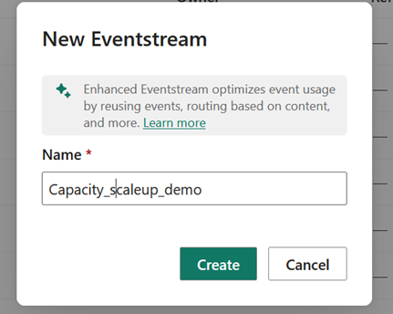

# Auto-scale Fabric capacity based on utilization


Organizations often face unpredictable, spiky analytics workloads that can lead to throttling and degraded performance when capacity becomes saturated. Since Microsoft Fabric does not provide built-in autoscale functionality today, this demo introduces an approach to dynamically scale capacity on demand—ensuring consistent performance while controlling costs and avoiding permanent over‑provisioning
The sample demonstrates how to monitor real-time capacity usage and automatically trigger a scale-up action when utilization exceeds defined thresholds. It also calls a notebook to execute additional logic. The accompanying diagram illustrates how the solution ingests capacity signals, processes them, and launches a notebook via Activator within an Eventstream in Real-Time Intelligence (RTI).


## Utilization Formula
```
utilization = capacityUnitMs / (baseCapacityUnits * windowDurationMs)
```

## Key Components
- Capture capacity data
- Process events via SQL
- Trigger actions via Activator

## SQL Script
```
WITH u AS (
  SELECT
    data.capacityId AS capacityId,
    data.capacityName AS capacityName,
    data.capacitySku AS capacitySku,
    data.windowStartTime AS windowStartTime,
    data.windowEndTime AS windowEndTime,
    CAST(data.baseCapacityUnits AS float) AS baseCapacityUnits,
    CAST(data.capacityUnitMs AS float) AS capacityUnitMs,
    CAST(
      CAST(data.capacityUnitMs AS float) /
      NULLIF(
        CAST(data.baseCapacityUnits AS float) *
        DATEDIFF(millisecond, data.windowStartTime, data.windowEndTime),
        0
      ) AS float
    ) AS utilization
  FROM [CapacityScaleupdemo-stream]
)
SELECT
  u.capacityId,
  u.capacityName,
  u.capacitySku,
  u.windowStartTime,
  u.windowEndTime,
  u.baseCapacityUnits,
  u.capacityUnitMs,
  u.utilization
INTO [Capacity-Activator]
FROM u;
```

## Full Notebook Code
```
# Fabric Notebook - Scale Fabric capacity via ARM using SP secret from Key Vault
import os
import time
import requests
from notebookutils import mssparkutils
from azure.identity import ClientSecretCredential
API_VERSION = "2023-11-01"
ARM_SCOPE = "https://management.azure.com/.default"
ARM_BASE  = "https://management.azure.com"
TENANT_ID = os.getenv("TENANT_ID", "<Your_TENANT_ID>")
CLIENT_ID = os.getenv("CLIENT_ID", "<Your_CLIENT_ID>")
SUB_ID   = os.getenv("AZ_SUBSCRIPTION_ID", "<YOUR_SUBSCRIPTION_ID>")
RG       = os.getenv("AZ_RESOURCE_GROUP", "<YOUR_RESOURCE_GROUP>")
CAPACITY = os.getenv("FABRIC_CAPACITY_NAME", "<YOUR_CAPACITY_NAME>")
KEYVAULT_URL   = os.getenv("KEYVAULT_URL", "https://<KEYVAULT_NAME>.vault.azure.net/")
KV_SECRET_NAME = os.getenv("KV_SECRET_NAME", "<YOUR_SECRET_NAME>")

def get_sp_secret_from_kv():
    return mssparkutils.credentials.getSecret(KEYVAULT_URL, KV_SECRET_NAME)

client_secret = get_sp_secret_from_kv()
cred = ClientSecretCredential(tenant_id=TENANT_ID, client_id=CLIENT_ID, client_secret=client_secret)

def bearer_token_arm():
    return cred.get_token(ARM_SCOPE).token

def headers_arm():
    return {"Authorization": f"Bearer {bearer_token_arm()}",
            "Content-Type": "application/json"}

def get_current_capacity_sku(subscription_id, resource_group, capacity_name):
    url = (
        f"{ARM_BASE}/subscriptions/{subscription_id}"
        f"/resourceGroups/{resource_group}"
        f"/providers/Microsoft.Fabric/capacities/{capacity_name}"
        f"?api-version={API_VERSION}"
    )
    r = requests.get(url, headers=headers_arm(), timeout=60)
    r.raise_for_status()
    return r.json().get("sku", {}).get("name")

def get_next_fsku(current_sku: str) -> str:
    if not current_sku or not current_sku.startswith("F") or not current_sku[1:].isdigit():
        raise ValueError(f"Invalid SKU format: {current_sku}")
    v = int(current_sku[1:])
    if v >= 2048:
        raise ValueError("Already at maximum SKU F2048. Cannot scale higher.")
    return f"F{v * 2}"

def scale_capacity(subscription_id, resource_group, capacity_name, target_sku):
    url = (
        f"{ARM_BASE}/subscriptions/{subscription_id}"
        f"/resourceGroups/{resource_group}"
        f"/providers/Microsoft.Fabric/capacities/{capacity_name}"
        f"?api-version={API_VERSION}"
    )
    body = {"sku": {"name": target_sku, "tier": "Fabric"}}
    resp = requests.patch(url, headers=headers_arm(), json=body, timeout=60)
    if resp.status_code in (200, 201):
        return resp.json()
    if resp.status_code == 202:
        async_url = resp.headers.get("Azure-AsyncOperation") or resp.headers.get("Location")
        if not async_url:
            raise RuntimeError("202 Accepted but no Azure-AsyncOperation/Location header to poll.")
        for _ in range(120):
            time.sleep(5)
            poll = requests.get(async_url, headers=headers_arm(), timeout=60)
            if poll.status_code == 200:
                data = poll.json()
                status = (data.get("status") or data.get("properties", {}).get("provisioningState") or "")
                if status.lower() in ("succeeded", "updated", "preparing"):
                    res = requests.get(url, headers=headers_arm(), timeout=60)
                    res.raise_for_status()
                    return res.json()
                if status.lower() in ("failed", "canceled"):
                    raise RuntimeError(f"Scaling failed: {data}")
        raise TimeoutError(f"Scaling did not finish. Poll: {async_url}")
    raise RuntimeError(f"Unexpected response: {resp.status_code} {resp.text}")

if __name__ == "__main__":
    try:
        sku = get_current_capacity_sku(SUB_ID, RG, CAPACITY)
        print("Current SKU:", sku)
        target = get_next_fsku(sku)
        print(f"Scale up {sku} → {target}")
    except Exception as e:
        print("Could not list SKUs:", e)
    try:
        result = scale_capacity(SUB_ID, RG, CAPACITY, target)
        print("Final capacity state:", result)
    except Exception as e:
        print("Scale failed:", e)
```
